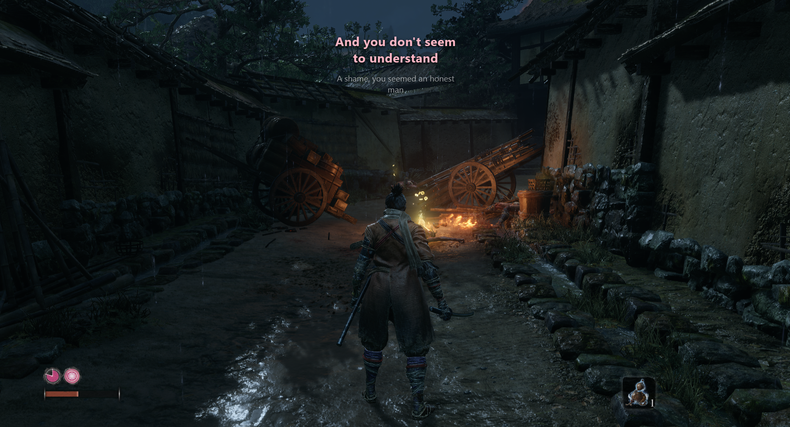
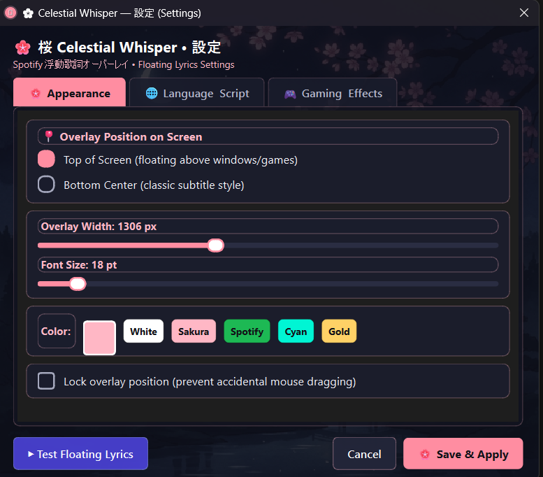

<div align="center">  <h1>✦ CELESTIAL WHISPER ✦</h1> <h3><em>Lyrics that stay with the scene.</em></h3> <p><strong>A beautiful, customizable Spotify lyrics overlay for Windows.</strong></p>

[](https://www.python.org/)
[](https://pypi.org/project/PyQt6/)
[](https://www.microsoft.com/windows)
[](https://spotify.com/)
[](./LICENSE)


<blockquote><strong>A small window into the song — never a window in the way.</strong></blockquote> </div>

---

<div align="center">


<h2>Music should not force you
to choose between listening and looking.</h2> </div>

**Celestial Whisper** turns synchronized lyrics into a quiet, translucent layer above your desktop. It follows Spotify playback through Windows Media Session and keeps the active lyric close to the moment without covering the world behind it.

<table>
<tr>
<td width="25%" align="center"><strong>NO LOGIN</strong>  
<sub>Native playback detection</sub></td>
<td width="25%" align="center"><strong>NO BOX</strong>  
<sub>Frameless transparency</sub></td>
<td width="25%" align="center"><strong>NO DISTRACTION</strong>  
<sub>Readable typography</sub></td>
<td width="25%" align="center"><strong>YOUR MODE</strong>  
<sub>Work · game · watch</sub></td>
</tr>
</table>   
 <div align="center">

　　

</div>

## 

<div align="center">


<h2>Stay inside the scene.</h2> </div>

Read while you play, browse, code, or watch. The overlay stays above your windows, uses high-contrast shadows for readability, and can become click-through when Game Mode is enabled.

<div align="center"> 

<sub><strong>Keep playing while the words stay within reach.</strong></sub>

</div>

## 

<div align="center">


</div> <table>
<tr>
<td width="50%" valign="top"> <h3>◌ A QUIET LAYER</h3>

Frameless, translucent, always on top, and designed to disappear into the scene. Place it at the top, use classic bottom-center subtitles, or drag it anywhere on your display.

</td>
<td width="50%" valign="top"> <h3>◌ NO API CEREMONY</h3>

Playback is detected through Windows Media Session instead of requiring a Spotify developer application, OAuth flow, or separate API setup.

</td>
</tr>
<tr>
<td width="50%" valign="top"> <h3>◌ LANGUAGE AS MOOD</h3>

Use original scripts, English meaning, or English letters / Hinglish / Romaji. Synchronized lyric variants are cached locally when available.

</td>
<td width="50%" valign="top"> <h3>◌ CONTROLS CLOSE AT HAND</h3>

Use the ♫ system tray for quick changes, preview sample lyrics, toggle Game Mode, switch language, or open the settings room.

</td>
</tr>
</table>

## 

<div align="center">


<h2>Your screen. Your colors. Your rhythm.</h2> </div>

The Sakura-themed settings panel keeps the most important controls in one focused place.

<div align="center"> 

<sub><strong>APPEARANCE</strong> — position, scale, color, and focus in one panel.</sub>

</div> <table>
<tr>
<td width="33%" align="center"><strong>APPEARANCE</strong>  
<sub>Position · width · font · color</sub></td>
<td width="33%" align="center"><strong>LANGUAGE</strong>  
<sub>Script · meaning · context</sub></td>
<td width="33%" align="center"><strong>EFFECTS</strong>  
<sub>Game Mode · motion · status</sub></td>
</tr>
</table>

## 

<div align="center">


</div>

### <kbd>OVERLAY</kbd>

- Frameless transparent lyric window with high-contrast drop shadows.

- Always-on-top behavior for borderless and fullscreen-style games.

- Top-of-screen, bottom-center, and free-drag positioning.

- Optional position lock to prevent accidental movement.

- Current-only, current + next, or previous + current + next lyric context.

- Adjustable width from **1000–1800 px** and font size from **16–44 pt**.

- White, Sakura, Spotify, Cyan, Gold, and custom active-line colors.

### <kbd>LYRICS</kbd>

- Synchronized `.lrc` parsing for line-level timing.

- Original native script mode for Devanagari, Japanese, Korean, and other scripts.

- English meaning mode for translated lyrics.

- English-letter mode for romanized lyrics, including Hinglish and Romaji-style output.

- Local lyric caching with graceful fallback behavior.

### <kbd>GAMING + MOTION</kbd>

- **Smooth Float Up** for a gentle lyric glide.

- **Instant Pop** for direct lyric changes.

- **Game Mode** for click-through overlay behavior.

- Borderless Windowed / Windowed Fullscreen guidance for reliable game overlays.

- System-tray controls for visibility, language, position, display mode, transition, preview, settings, and exit.

## 

<div align="center">


</div>

### Requirements

`Windows 10 (1809+)` · `Windows 11` · `Python 3.10+` · `Spotify Desktop or Web Player`

### Install

```bash
git clone https://github.com/Legend-1s-here/Celestial-Whisper.git
cd Celestial-Whisper
py -m pip install -r requirements.txt
```

### Launch

```bash
py main.py
```

For a silent Windows launch without a terminal window, open `Celestial Whisper.vbs` or `run.bat`.

To create Desktop and Start Menu shortcuts:

```
powershell -ExecutionPolicy Bypass -File create_shortcut.ps1
```

Play a song on Spotify and the overlay will begin listening for the active track. To test the interface first, choose **Preview Sample Lyrics** from the system tray.

## 

<div align="center">


</div>

| Action | Control |
| --- | --- |
| Move the overlay | Click and drag the lyric window |
| Open settings | Double-click the overlay or choose **Settings** from the tray |
| Change position | Overlay context menu or tray → **Position** |
| Change script | Tray → **Lyrics Script** |
| Change context | Tray → **Lyrics Display** |
| Change motion | Tray → **Transition Effect** |
| Enable Game Mode | Tray → **Game Mode (Click-Through Overlay)** |
| Preview the experience | Tray → **Preview Sample Lyrics** |
| Show / hide | Click the ♫ tray icon |
| Exit | Tray or overlay context menu → **Exit** |

## 

<div align="center">


</div>

```
Celestial-Whisper/
├── main.py                    # Application controller and preview mode
├── overlay.py                 # Transparent, draggable lyrics window
├── settings_ui.py             # Sakura-themed tabbed settings dialog
├── spotify_client.py          # Windows Media Session worker
├── media_monitor.ps1          # Playback metadata stream
├── lyrics_fetcher.py          # LRC parsing, caching, translation, romanization
├── tray.py                    # Windows system tray menu and actions
├── config.py                  # Persistent configuration management
├── config.example.json        # Example configuration
├── create_shortcut.ps1        # Desktop and Start Menu shortcut helper
├── Celestial Whisper.vbs      # Silent Windows launcher
├── run.bat                    # Windows batch launcher
├── japanese_bg.jpg            # Settings background artwork
├── app.ico                    # Application icon
├── requirements.txt           # Python dependencies
└── assets/
    ├── celestial-whisper-banner.png
    ├── floating-lyrics-example.png
    └── settings-appearance.png
```

## 

<div align="center">


<h2>Midnight indigo · Sakura pink · luminous text</h2> <p>Celestial Whisper takes cues from Japanese night scenes and music-player minimalism, keeping the interface soft enough to feel present without becoming another dashboard.</p>
<blockquote><strong>Made for the moments when the song becomes part of the scene.</strong>  
<sub>listen softly · stay in the world</sub></blockquote> </div>

## License

Celestial Whisper is released under the [MIT License](./LICENSE).
